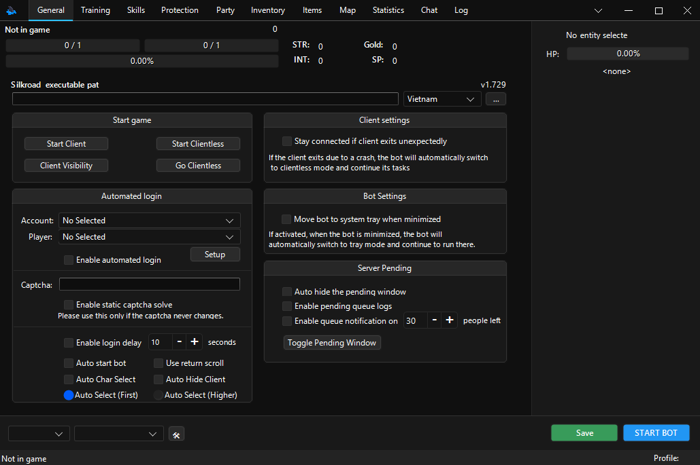
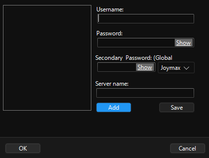
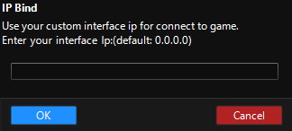

# General

Now that you’re finished with Starting off you can launch your game with `Start Client` from `Start game` subsection and explore as you read through.

| Silkroad executable path                                                                                          |
|:------------------------------------------------------------------------------------------------------------------|
| Displays the absolute path to your client executable. From the list on the right, you can select your client type |

> [!TIP]
> Use the button `...` to select your executable path with a file explorer.

## Start game

| Start \| Kill Client       |
|:---------------------------|
| Starts or kills the client |

| Start Clientless                                                                                                                     |
|:-------------------------------------------------------------------------------------------------------------------------------------|
| Starts the client as clientless, you won't be able to hide or unhide the client until you kill the client and start the client again |

| Hide \| Unhide Client            |
|:---------------------------------|
| Hides or unhides the game client |

| Go Clientless                                             |
|:----------------------------------------------------------|
| When you start the client normally, you can go clientless |

## Automated login

| Account                                       |
|:----------------------------------------------|
| A list of account entries you can select from |

| Player                                                     |
|:-----------------------------------------------------------|
| A list of characters you've created in-game to select from |

> [!NOTE]
> You will be able to see your characters' names listed here after you login

| Enable automated login                                          |
|:----------------------------------------------------------------|
| Logs you into the game with the specified account and character |

| Captcha                              |
|:-------------------------------------|
| Solves the dynamic captchas on login |

| Enable static captcha solve                                                                                    |
|:---------------------------------------------------------------------------------------------------------------|
| If the captcha doesn't change with every login mark this option enter the value that is present on the  client |

| Auto start bot                                 |
|:-----------------------------------------------|
| Starts the bot loop when you login to the game |

| Use return scroll                               |
|:------------------------------------------------|
| Will use a return scroll after you’ve logged in |

| Auto Char Select                                                                  |
|:----------------------------------------------------------------------------------|
| Selects a character automatically based on the `Auto Select` option you've marked |

| Auto Hide Client |
|:-----------------|
|    Hides client on login              |

### Creating a login entry

Click on `Setup`:

Type your:

- `Username`
- `Password`
- `Secondary Password`

> [!IMPORTANT]
> iSRO clients will require in-game second passwords that only consist of numbers, enter that and select `Joymax` or `JCPlanet` depending on where you created your account.

- `Server name`

> [!IMPORTANT]
> You don’t need to enter this if your client only has one server, it’ll automatically select that on. Otherwise, enter your server's name.

- Click on `Add`, and voila! You’ve created your first login entry. If you wish to edit this entry click on your username on the list, edit the desired part and then click `Save` and `OK`.
- Select your account and tick `Enable automated login`.

## Client settings & Bot settings

Lets you customize client and bot behavior.

## Server Pending

Options regarding pending login entries.

## Footer

Shows the server information, contains IP Bind button, a save button for the bot configuration, a start stop button

### Footer > IP Bind

Allows you to bind an IP.

