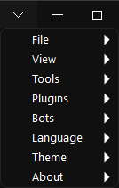
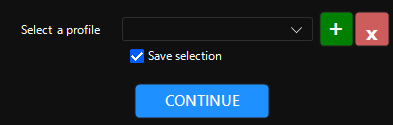
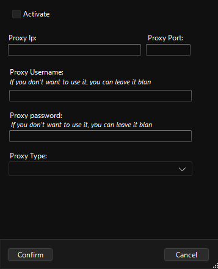
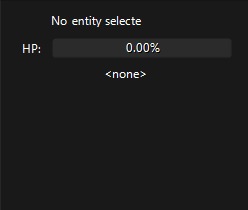
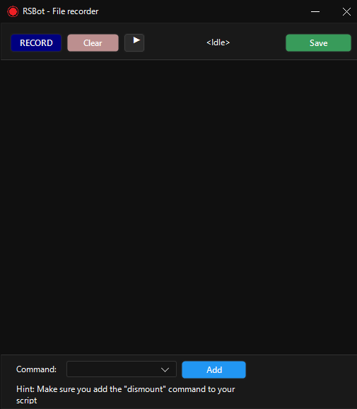
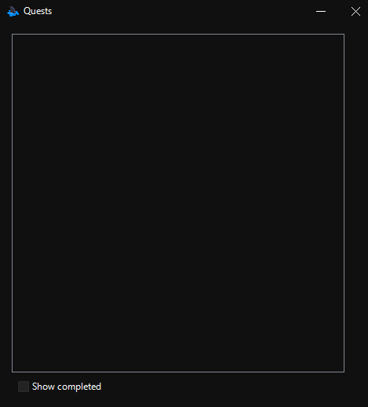
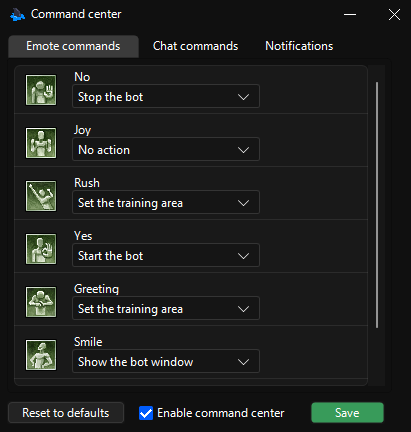
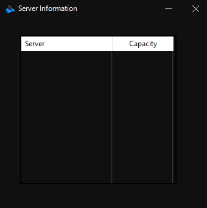

# Menu bar

## File

### File > Select Profile

You can delete, add, save selection of profiles with a pop-up. You can alternatively summon the same pop-up on top right `%profile-name%`.

> [!TIP]
> Bot will save the configurations for only one character, so if you were to login to another character it won’t have the same configuration as the other character.

> [!TIP]
> You can use profiles to automatically select your desired account / character with the profile pargs.

> [!IMPORTANT]
> If you create a login entry, that entry will only show up on the profile you have selected.

> [!WARNING]
> Profiles will only store data in the general tab, auto-login etc.

### File > Proxy Config

Settings regarding proxy.

### File > Exit

Exits the bot.

## View > Sidebar

Shows your pets and targeted entities if you’ve ticked it.

## Tools > Script Recorder

Script recording tool.

> [!TIP]
> If you’re going to make a script to go to the training area, let the bot execute town script and then start recording to get to the town loop's last coordinate as a starting point to avoid any collision.

> [!TIP]
> You can cast skills, it’ll be logged into the script.

> [!TIP]
> For teleportation you need NPC’s type and teleportation option's name. Type can be found in the `Map` > `Entity list` and name is the name of the teleportation without the square brackets e.g. `Sigia Drock`.

> [!TIP]
> The town scripts are created using this. You can edit them if you feel like it.

> [!WARNING]
> Don’t go too far between 2 points. Bot won't be able to execute the movement to the specified coordinates, causing your script to fail.

## Plugins

Every aspect of the bot is essentially a plugin, you may integrate any 3rd party plugins you may desire on `<RSBOT directory>/Data/Plugins`. You can find minor plugins here.

### Plugins > Quests

Shows your quests.

### Plugins > Command Center

Allows you to control the bot directly from the client. Available actions are:

- Set the training area
- Cast all buffs
- Show the bot window
- Start the bot
- Set training area and start bot
- Stop the bot

You can invoke them through the chat or emotes. Defaults are:

| Bot command                     | Emote action         | Chat command |
|:--------------------------------|:---------------------|:-------------|
| Set the training area           | `Rush` \| `Greeting` | `\here`      |
| Cast all buffs                  | unbound              | `\buff`      |
| Show the bot window             | `Smile`              | `\show`      |
| Start the bot                   | `Yes`                | `\start`     |
| Set training area and start bot | unbound              | `\here`      |
| Stop the bot                    | `No`                 | `\stop`      |

### Plugins > Server Information

Shows information about the server like server name and their capacity.

## Bots

Allows you to choose a bot base to determine what the bot will do while it's working. There are currently 4 bot bases:

- [Alchemy](05.-Alchemy.md)
- [Training](04.-Training.md) (Default)
- [Lure](06.-Lure.md)
- [Trade](07.-Trade.md)

When you select another bot base, the second tab will be replaced with the bot base you've selected.

## Language

Lets you select your desired language. Currently supported languages are:

- English
- German
- Turkish
- Spanish
- Vietnamase
- Russian
- Arabic

## Theme

Lets you determine the color theme of the UI. Dark, Light, Auto or user specified color.

## About

Displays links that are connected with the bot.
