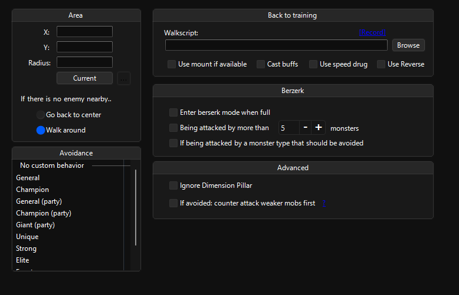

# Training

## Area

Lets you select a training area and characters’ behavior.

> [!TIP]
> Select `Go back to center` on your buffers for them to not wander around.

> [!WARNING]
> It's recommended that you specify an area that isn’t on a trade route or isn't a populated area. Bot will try to target NPC thieves and possibly trade pets which will stutter the bot or bot might PK people randomly.
>
> `might be fixed?`

## Avoidance

Lets you avoid & prefer certain type of mobs and choose which mob to use berserk to.

## Back to training

Lets you determine which script to use to the training area and the behavior while executing that script.

\[RECORD\] button opens the [Script Recorder](03.-Menu.md#tools--script-recorder) tool and starts the recording

> [!TIP]
> If you’re searching for the auto-usage of speed drugs, marking `Use speed drug` will do it.

> [!IMPORTANT]
> `Use Reverse` will use the last death point.

> [!WARNING]
> `Cast buffs` will use `Buffing skills` on `Training`.

## Berserk

Lets you determine when to use berserk.

## Advanced

Contains an option to ignore dimension pillars and attacking weaker mobs when there is an avoided mob type.
