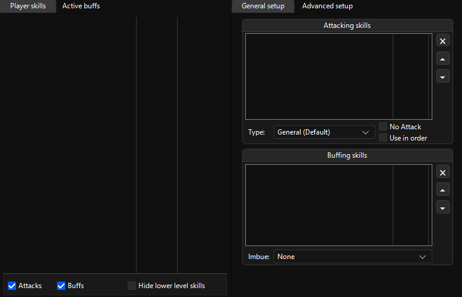
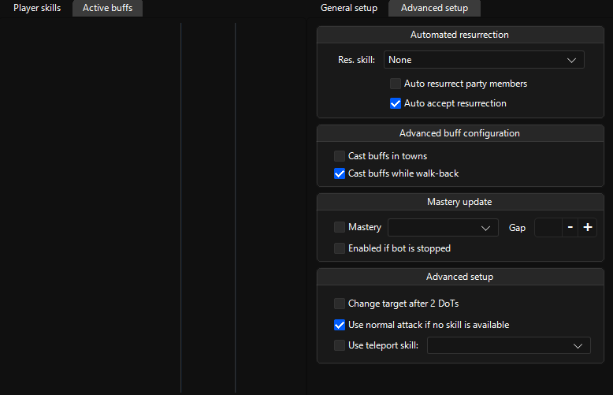

# Skills

## First subsections

### Player skills

Will list your skills and let you add them into `Attacking skills` & `Buffing skills` with right click, use buffs on yourself or others.

> [!TIP]
> Use the bottom ticks to filter through your skills while configuring your training skills.

### General setup

Will list the skills you’ve selected to train, buttons that can order the list or remove a skill and some behavior

> [!TIP]
> General types’ skills will apply to all mob types that doesn’t have skills.

> [!TIP]
> If your character is low on mana and has high mana abilitites, it's recommended to put high mana skills to the top.

> [!WARNING]
> Because the bot always attacks and if your mana pool is low, your character might not find the mana to recast things like "Holy Recovery Division". A fix for this may be to not use too many skills that require high mana like "Healing Cycle" as it will constantly lower your mana because of it’s low cooldown.

## Second subsections

### Active buffs

Will list your characters’ buffs.

### Advanced setup

Contains:

- Automated resurrection & acception of resurrections
- Buff casting in towns and on walkscripts
- Mastery update
- Attack behavior modification

> [!WARNING]
> Option `Change target after 2 DoTs` doesn't work properly
