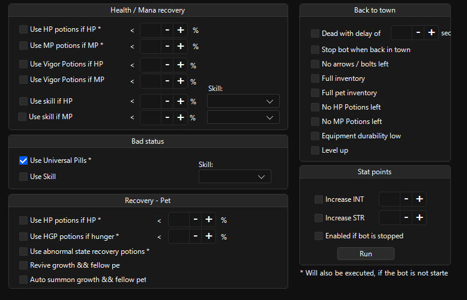

# Protection

Consists of options for consumables and when to use them, when to go back on a bot loop, automatic stat distrubution.

## Health / Mana recovery

Automated potion usage and skill for HP/MP through bot.

## Bad status

Uses pills and skills if it’s set.

## Recovery - Pet

Pet auto potion usage and revival.

> [!CAUTION]
> Bot might not recognize fellow if it’s name is changed from defaults. Just leave the desired fellow on if this is an issue for you.
>
> `might be fixed?`

## Back to town

Options that determine when to go to town.

## Stat Points

Useful tool to distribute stat points.

> [!TIP]
> Tick `Enabled if bot is stopped` to run it all the time.
