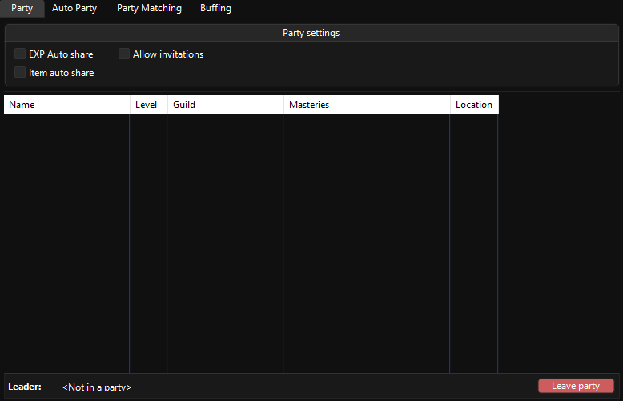
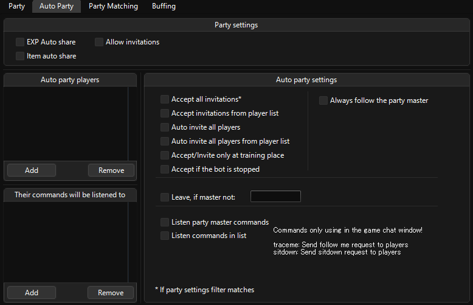
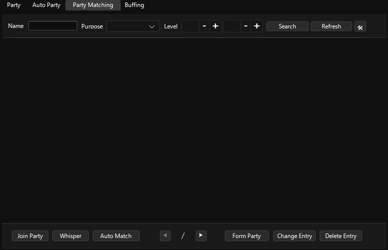
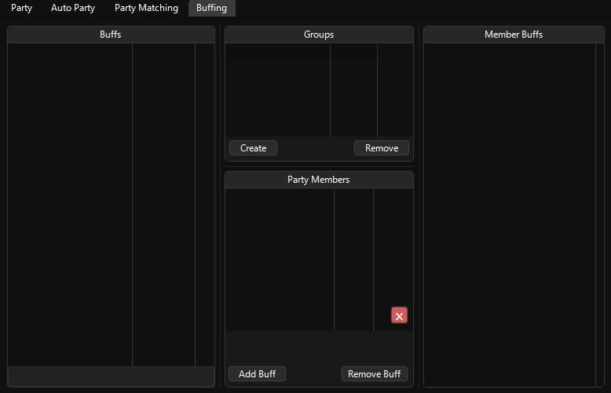

# Party

## Party

Consists of your party's members and specifications. With right click on members you can banish them if you’re the party leader, leave the party, add them into groups for buffing.

## Auto Party

Automation of party invitations, acceptions and some in-game chat command privileges.

> [!WARNING]
> Bot will try to send invitations even if the party is full and to job players even if you're not wearing a job suit.

## Party Matching

Management of party forms, auto forming etc.

## Buffing

Lets you create groups to buff, specify buffs to those groups.

