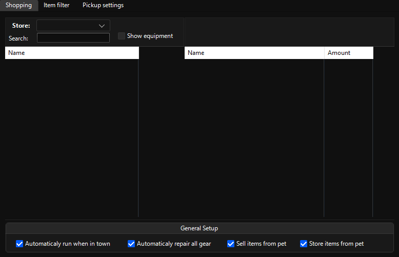
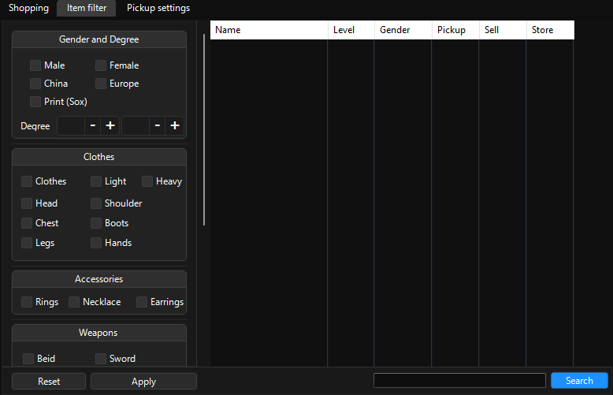
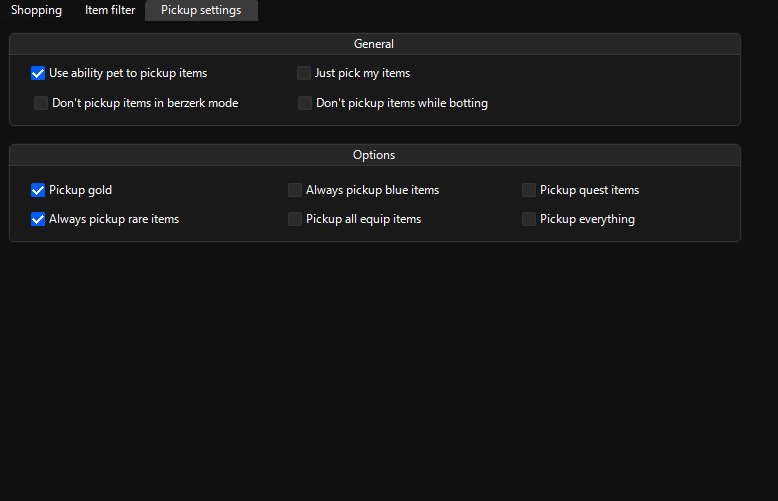

# Items

## Shopping

Make a shopping list for consumables here.

## Item filter

Filtering items to pick up / sell / store.

> [!TIP]
> `Clothes` = `Garment` / `Robe` || `Light` = `Protector` / `Light Armor` || `Heavy` = `Armor` / `Heavy Armor`.

> [!TIP]
> When you’re finished selecting items to sell / store It's recommended you search for all items with `Rare (SoX)` option marked without any other selections and tick them all with `Don’t sell` and `Store` to not have any issues with valuables.

> [!TIP]
> If you have a secondary weapon / shield that you use, search with the name of your weapons and untick sell / store as bot currently doesn’t have a function to mark your items as main weapon / secondary weapon / shield.

> [!IMPORTANT]
> On clothes, if you select `Clothes`, `Light`, `Heavy` without the type of the item (`Head`, `Chest` etc.) it won’t display all equipment of that type, instead it will show you the entire list.

> [!WARNING]
> Because the accessories don’t have a gender attribute you’ll end up with nothing if you select a gender and an accessory type.

> [!WARNING]
> Bot can't list stones based on their degree. Use search to get your desired stone degree with `(Lvl.x)` x as the degree.

## Pickup settings

Modifies the behavior of item picking.

> [!IMPORTANT]
> Tick in-game `Grab function` to `ON`, `Target grab authority` to `Grab all items` and `Target item` to only `Gold` to ensure that your pet will pick gold and only the filtered items.
