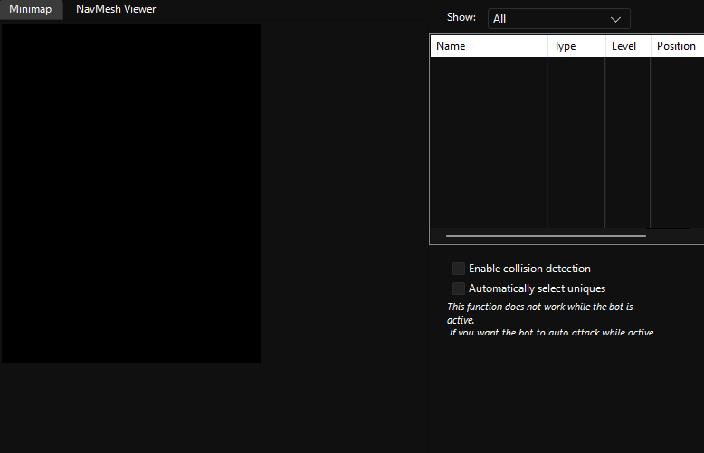
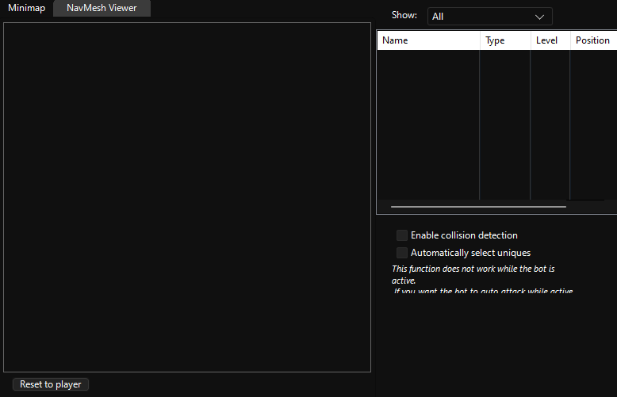

# Map

## Minimap

Lets you see the map, entities in range, training area and your scripts if it’s currently executing one.

> [!TIP]
> You can navigate using the map. Movement can be recorded to the `Script Recorder`

> [!WARNING]
> Doesn’t work in caves.
>
> `might be fixed?`

## NavMesh Viewer

Shows the navigation mesh. (?)

